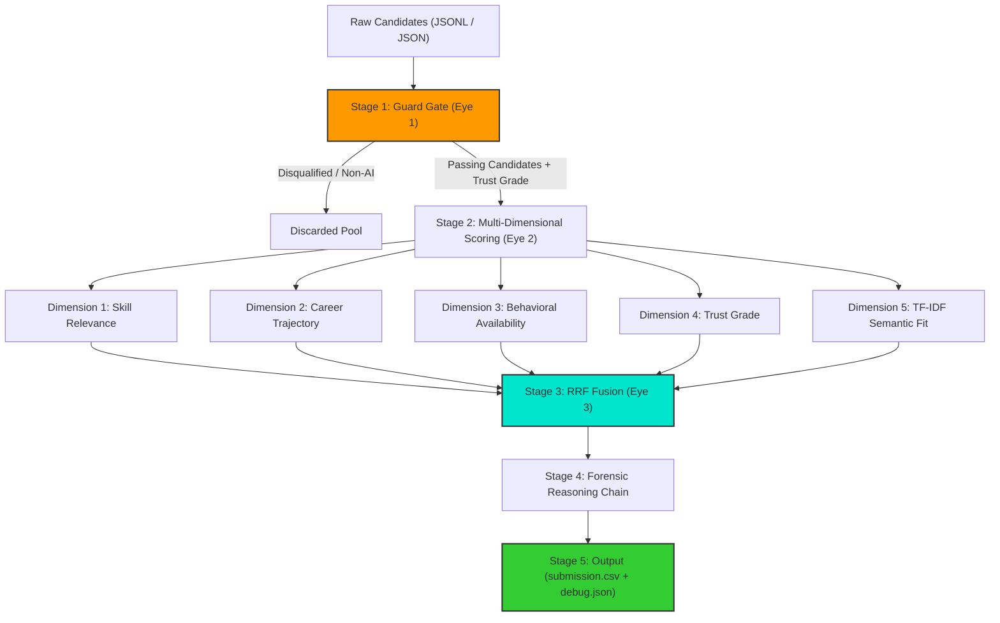

# 🔱 Project Trinetra (त्रिनेत्र) — Architecture Blueprint

> **Three Eyes. Zero Fakes.**
> *A Trust-First, Multi-Dimensional Talent Forensics and Ranking Engine.*

---

## 1. System Overview

Traditional candidate ranking systems suffer from a fatal flaw: they measure **relevance** (keyword and semantic similarity) without validating **trust** (profile integrity). In adversarial environments—such as recruitment datasets seeded with synthetic candidates, keyword stuffers, and chronological anomalies (honeypots)—these systems rank the most convincing fabrications at the top.

Project Trinetra inverts this paradigm: **Trust Before Relevance**.



---

## 2. Pipeline Execution Stages

### 👁️ Stage 1: The Guard Gate (Eye 1 — Trust Verification)
The Guard Gate filters out invalid profiles and assigns a **Trust Grade (A, B, C, D, F)** to surviving candidates before any relevance computations occur.
*   **Chronological Integrity Engine**: Cross-references job start and end dates with claimed duration months. Detects mathematically impossible spans (e.g., claiming 96 months of experience in a 24-month calendar gap) and overlapping college/work timelines.
*   **Company Authenticity Classifier**: Categorizes employment history into:
    *   *Product Giants & High-Growth Startups* (Swiggy, Flipkart, Google, etc. — positive modifiers).
    *   *IT Consulting/Services* (TCS, Wipro, Infosys, etc. — down-weighted/penalized).
    *   *Fictional Companies* (Hooli, Dunder Mifflin, Acme Corp, etc. — soft penalty, markers of synthetic data/noise).
*   **Keyword Stuffer Detector**: Flags non-engineering/non-AI profiles (e.g., "Marketing Manager", "Accountant") that claim 5+ expert AI skills but have no career history mentioning AI.
*   **Empty Expertise Filter**: Identifies profiles claiming "expert" status across multiple skills with exactly `duration_months: 0` and $\le$ 1 endorsement (classic synthetic honeypots).
*   **Disqualification Filter**: Immediately drops candidates outside the AI/engineering domain or strictly specialized in Computer Vision/Robotics without NLP/IR exposure.

### 👁️ Stage 2: Multi-Dimensional Scoring (Eye 2 — Independence)
Instead of collapsing all features into a single weighted score, Trinetra ranks candidates across **5 orthogonal dimensions**:
1.  **Skill Relevance**: Source-weighted keyword matching. Career descriptions carry a weight of `1.0`, current titles `0.85`, headlines/summaries `0.45`, and self-reported skill names `0.25`.
2.  **Career Trajectory**: Evaluates Years of Experience (YOE) sweet-spot fit (5–9 years), tenure stability (penalizes frequent switching under 1.5 years), progressive seniority (e.g., "Senior", "Lead" promotions), product company exposure ratio, and target geographic fit (Pune/Noida).
3.  **Behavioral Availability**: Processes Redrob's 23 behavioral signals. Combines notice period (prefers sub-30 days), activity recency (`last_active_date`), response rates, interview completion metrics, and contact verification.
4.  **Trust Rank**: Pass-through of the Guard Gate's trust score. Candidates with a Grade of F or severe penalties are pushed down the ranking.
5.  **Semantic Fit**: Batch TF-IDF cosine similarity between candidate profiles and a synthetically expanded Job Description query containing key phrases and weighted concepts.

### 👁️ Stage 3: Reciprocal Rank Fusion (Eye 3 — Wisdom Fusion)
Fuses the 5 independent dimension rank lists into a single consolidated ranking. 
*   **Formula**: 
    $$RRF\_Score(c) = \sum_{m \in M} \frac{w_m}{k + rank_m(c)}$$
*   **Where**:
    *   $M$ represents the 5 dimensions.
    *   $k = 60$ (standard smoothing constant to prevent top-rank bias).
    *   $w_m$ represents mild dimension weights: `trust = 1.2`, `skill = 1.0`, `career = 1.0`, `behavioral = 0.8`, `semantic = 0.6`.
*   RRF eliminates the fragility of hand-tuned weight combinations, offering robust mathematical generalization.
*   **Tie-Breaking**: Ties in RRF scores are resolved deterministically by `candidate_id` ascending (lexicographical order), ensuring valid formatting.

### ✍️ Stage 4: Forensic Reasoning Chain
During evaluation, the system accumulates a structured trace. The top 100 candidates get a human-readable, 1-2 sentence detective-style case file in their `reasoning` field:
*   References specific experience spans (e.g., "6.2 years at Google").
*   Highlights core technical alignments (e.g., "deployed FAISS vector search").
*   Acknowledges gaps and behavioral indicators (e.g., "30d notice period, active 2 days ago").
*   Appends the dimensional rank summary (e.g., `Dim ranks: S#3/C#12/B#1/T#45`).

---

## 3. Directory Layout & Module Index

```
project-trinetra/
├── ARCHITECTURE.md          # This file (system architecture memory)
├── DESIGN.md                # UI/UX design tokens & visual guidelines (VSF)
├── requirements.txt         # Package dependencies (Streamlit, numpy, scikit-learn, pytest)
├── submission.csv           # Last generated submission output (valid top-100 format)
├── src/
│   ├── __init__.py
│   ├── loader.py            # Memory-efficient JSONL/JSON loader & text extractor
│   ├── guard_gate.py        # Trust verification and honeypot detection (Eye 1)
│   ├── jd.py                # Job description keywords, service lists, and mappings
│   ├── rankers.py           # Dimension scoring logic (Skills, Career, Behavior) (Eye 2)
│   ├── semantic.py          # TF-IDF vectorizer and query expansion (Eye 2b)
│   ├── fusion.py            # Reciprocal Rank Fusion (Eye 3)
│   ├── reasoning.py         # Structured explanation chain compiler (Stage 4)
│   ├── rank.py              # CLI orchestration script
│   └── validate.py          # Post-run submission validator
└── tests/
    ├── test_guard_gate.py   # Eye 1 unit tests (10 passing tests)
    └── test_fusion.py       # Eye 3 unit tests (5 passing tests)
```

---

## 4. Performance & Hardware profile

*   **Runtime Boundary**: $\le$ 5 minutes wall-clock limit on a single CPU core.
*   **Memory Footprint**: Streams data line-by-line using generators to remain under 512MB RAM during loading (easily fits inside a 16GB sandboxed environment).
*   **Real-world Benchmark**:
    *   *Total candidate pool*: 100,000 candidates
    *   *Execution time*: **193 seconds** (~3.2 minutes) on full 100K JSONL
    *   *Honeypot detection*: 11 hard honeypots (0 in top 100)
    *   *Disqualified pool*: ~40,000 non-AI/non-engineering profiles
